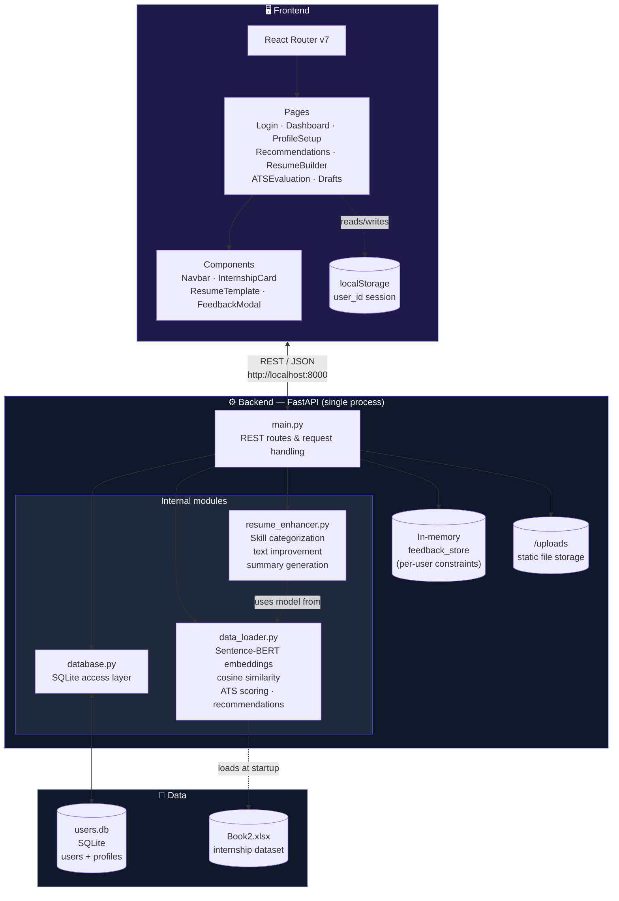

<div align="center">

# 🎯 CareerLens

**AI-powered internship recommendation and career tools platform**

Find your best-fit internships, build ATS-optimized resumes, and evaluate your application strength — all in one place.

[](https://react.dev/)
[](https://vitejs.dev/)
[](https://fastapi.tiangolo.com/)
[](https://www.python.org/)
[](https://www.sqlite.org/)
[](https://www.sbert.net/)


</div>

---

## 📖 Overview

**CareerLens** helps students and early-career candidates navigate the internship search with three core AI-driven tools:

- 🔍 **Semantic internship matching** powered by Sentence-BERT embeddings
- 📄 **ATS-friendly resume generation** with an inline, editable live preview
- ✅ **ATS compatibility scoring** against real job requirements

The system also **learns from user feedback** — every "dislike" reason (bad location, low stipend, wrong domain, etc.) refines future recommendations in real time.

---

## ✨ Features

| Feature | Description |
|---|---|
| 🤖 **Smart Recommendations** | Semantic ML-based internship matching using Sentence-BERT embeddings + cosine similarity |
| 🔁 **Adaptive Feedback Loop** | Dislike an internship with a reason, and the system builds per-user constraints to filter future results |
| 📝 **Resume Builder** | Auto-generates an ATS-friendly resume from your profile with a click-to-edit live preview and draft saving |
| 📊 **ATS Evaluation** | Upload a resume PDF and score it against a specific internship using hybrid semantic + keyword scoring |
| 🧑‍🎓 **Profile Setup** | Full profile builder — education, skills, projects, achievements, preferred domains, and document uploads |
| ❤️ **Liked Recommendations** | Save internships you're interested in for later review |

---

## 🏗️ Architecture

CareerLens follows a **decoupled client–server architecture**: a single-page React frontend communicates with a modular FastAPI backend over a REST API. The backend itself is cleanly separated by responsibility rather than bundled into one script.



> **Note:** This is a single FastAPI service with clearly separated internal modules (routing, ML/data logic, resume enhancement, persistence) — not a distributed microservices system. Each module could be extracted into its own independently deployable service in the future (e.g. a standalone recommendation service or resume-enhancement service), but today they run in one process against one SQLite database.

---

## 🛠️ Tech Stack

### Frontend
| Technology | Purpose |
|---|---|
| React 19 + Vite 8 | UI framework and build tooling |
| React Router v7 | Client-side routing |
| Lucide React | Icon library |
| html2pdf.js / jsPDF | PDF generation for resume download |

### Backend
| Technology | Purpose |
|---|---|
| FastAPI | REST API framework |
| Sentence-BERT (`all-MiniLM-L6-v2`) | Semantic embedding model |
| scikit-learn | Cosine similarity computation |
| PyPDF2 | PDF text extraction |
| SQLite | User and profile persistence |
| pandas / numpy | Data processing |

---

## 📂 Project Structure

```
├── frontend/
│   ├── src/
│   │   ├── pages/
│   │   │   ├── Login.jsx
│   │   │   ├── Signup.jsx
│   │   │   ├── Dashboard.jsx
│   │   │   ├── ProfileSetup.jsx
│   │   │   ├── Recommendations.jsx
│   │   │   ├── ResumeBuilder.jsx
│   │   │   ├── ATSEvaluation.jsx
│   │   │   ├── LikedRecommendations.jsx
│   │   │   └── ResumeDrafts.jsx
│   │   ├── components/
│   │   │   ├── Navbar.jsx
│   │   │   ├── InternshipCard.jsx
│   │   │   ├── ResumeTemplate.jsx
│   │   │   └── FeedbackModal.jsx
│   │   ├── App.jsx
│   │   └── main.jsx
│   ├── public/
│   ├── index.html
│   └── package.json
│
└── backend/
    ├── main.py            # FastAPI app and all route handlers
    ├── data_loader.py     # Internship data loading, embeddings, ATS evaluation, recommendations
    ├── resume_enhancer.py # Offline ML pipeline for skill categorization and text improvement
    ├── database.py        # SQLite helpers for users and profiles
    └── Book2.xlsx         # Internship dataset (not included in repo)
```

---

## 🚀 Getting Started

### Prerequisites

- Node.js >= 20
- Python >= 3.9
- pip

### Backend Setup

```bash
cd backend

# Create a virtual environment
python -m venv venv

# Activate the virtual environment
# On Windows:
venv\Scripts\activate
# On macOS/Linux:
source venv/bin/activate

# Install dependencies
pip install -r requirements.txt

# Run the server
uvicorn main:app --reload --port 8000
```

> **Note:** Update the `file_path` in `backend/data_loader.py` to point to your local internship dataset (`Book2.xlsx`).

### Frontend Setup

```bash
cd frontend
npm install
npm run dev
```

The frontend will be available at **http://localhost:5173**, and the API at **http://localhost:8000**.

---

## 📡 API Reference

| Method | Endpoint | Description |
|---|---|---|
| `POST` | `/signup` | Register a new user |
| `POST` | `/login` | Authenticate and retrieve user ID |
| `GET` | `/profile/{user_id}` | Fetch saved profile data |
| `POST` | `/profile/{user_id}` | Save or update profile data |
| `POST` | `/recommend` | Get top-N internship recommendations |
| `POST` | `/feedback` | Submit dislike feedback and update constraints |
| `POST` | `/evaluate_ats` | Run ATS scoring for a resume against an internship |
| `POST` | `/enhance_profile` | Run the offline resume enhancement pipeline |
| `POST` | `/upload` | Upload a file (resume or certificate) |
| `POST` | `/extract_pdf` | Extract raw text from a PDF |
| `GET` | `/internships/light` | Get lightweight internship list (ID + title) |

---

## 🧠 How the Recommendation Engine Works

1. The user's skills, education, achievements, resume text, and certificates are combined into a single unified profile string.
2. This string is encoded into a dense vector using Sentence-BERT (`all-MiniLM-L6-v2`).
3. Cosine similarity is computed against precomputed embeddings for all internships in the dataset.
4. Results are filtered against user-learned constraints (excluded locations, domains, stipend thresholds, etc.) derived from previous dislike feedback.
5. The top-N highest-scoring internships are returned.

---

## ✅ How the ATS Scorer Works

The ATS score is a weighted hybrid of two signals:

- **Semantic Score (60%)** — Cosine similarity between the resume embedding and the target internship embedding
- **Keyword Score (40%)** — Fraction of required skill tags from the internship description that appear in the resume text

```
Final Score = ((semantic_similarity × 0.6) + (keyword_match_rate × 0.4)) × 100
```

---

## 🪄 Resume Enhancement Pipeline

The `ResumeEnhancer` class runs entirely offline (no external API calls) and performs:

- **Skill Categorization** — Maps flat skill lists into semantic groups (Domain Skills, Tools & Technologies, Core Concepts, etc.) using rule-based lookup with a Sentence-BERT fallback
- **Description Improvement** — Applies regex-based verb replacement and bullet point normalization
- **Summary Generation** — Auto-generates a professional summary if none exists
- **Certificate Name Extraction** — Extracts clean course names from raw PDF text using pattern matching

---

## ⚠️ Environment Notes

- The backend serves uploaded files as static assets from the `/uploads` directory on `http://localhost:8000/uploads/`.
- User sessions are managed via `localStorage` (`user_id` key) on the frontend — no JWT or cookie-based auth.
- The feedback constraint store is in-memory and resets on server restart. For production use, persist `feedback_store` to the database.


---

<div align="center">

</div>
